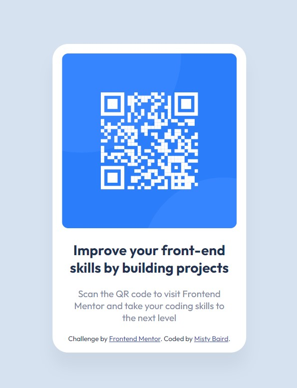

# Frontend Mentor - QR code component solution

This is a solution to the [QR code component challenge on Frontend Mentor](https://www.frontendmentor.io/challenges/qr-code-component-iux_sIO_H). Frontend Mentor challenges help you improve your coding skills by building realistic projects. 

## Table of contents

- [Overview](#overview)
  - [Screenshot](#screenshot)
  - [Links](#links)
- [My process](#my-process)
  - [Built with](#built-with)
  - [What I learned](#what-i-learned)
  - [Continued development](#continued-development)
  - [Useful resources](#useful-resources)
- [Author](#author)


## Overview

### Screenshot



### Links

- Solution URL: [Add solution URL here](https://your-solution-url.com)

## My process

I first started by arranging the HTML. I tackled the more straightforward CSS first - colors, fonts, etc. I spent quite some time on centering!

### Built with

- Semantic HTML5 markup
- CSS custom properties
- Flexbox
- Mobile-first workflow

### What I learned

I tried several different ways to center the large container vertically, and ended up using the transform property, and if I'm honest, I still don't fully grasp it? Mostly, I don't really understand why top and left are 50% and then the translate is also -50%? I just need to play around with it more and read more of the documentation.  

```css
    position: absolute;
    top: 50%;
    left: 50%;
    transform: translate(-50%, -50%);
```

I really wanted to get Flexbox to work. I tried creating a container/div that was a bit of a surrogate for the entire viewport and surrounded the container with the white background and using the following:

```css
.overall-container {
  width: 100vw;
  height: 100vh;
  display: flex;
  justify-content: center;
  align-items: center;
}
```
And, this *seems* like it should work to me, but it ended up looking funny, so I went with the transform and associated properties. Again, I'm sure there's a piece I'm not thinking about clearly or don't understand. More practice is necessary, obviously.

### Continued development

I am absolutely going to continue working with centering items vertically.

### Useful resources

- [W3Schools, How To Center Elements Vertically](https://www.w3schools.com/howto/howto_css_center-vertical.asp) - This is where I found the code for centering vertically.


## Author

- Frontend Mentor - [@mistydb](https://www.frontendmentor.io/profile/mistydb)
- Twitter - [@MistyDBaird](https://www.twitter.com/MistyDBaird)
- GitHub - [@mistydb][https://github.com/mistydb]

